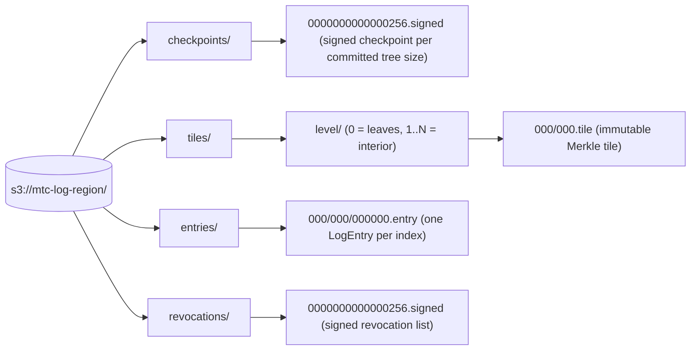
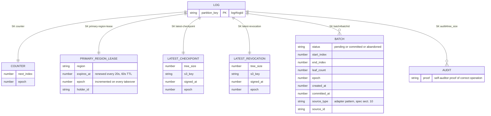

# Data Model

> **Source of truth:** [`docs/mtc-architecture-spec.md`](../mtc-architecture-spec.md) §8
> (Data Model: §8.1 S3 layout, §8.2 DynamoDB schema, §8.3 lease semantics, §8.4 in-memory state).
> The first diagram renders the §8.1 S3 object layout; the second renders the §8.2 DynamoDB
> single-table item inventory.
>
> **Update this page when:** the S3 prefix layout changes, DDB item types or key attributes are
> added/removed, or the PK/SK pattern changes. Any PR that changes the storage schema must update
> this page in the same PR.

## S3 layout (spec §8.1)

One bucket per region, identical structure, CRR with Replication Time Control. All objects are
immutable once written (Object Lock, Compliance mode); names are fixed-width zero-padded for
lexicographic ordering.

## DynamoDB coordination table (spec §8.2)

Single Global Table `mtc-log-coordination`, replicated to all three regions.
`PK = log#{logId}`; item type is encoded in the `SK` pattern. This is coordination state only —
log content lives exclusively in S3.

## Reading guide

- **Epoch appears on every mutable item** — every conditional write includes
  `epoch = :currentEpoch`, which is what makes split-brain impossible (spec §8.3, §13.4).
- **S3 is content, DDB is coordination**: proofs and certificates are served entirely from S3
  objects; DDB items only point at them (`s3_key`) and sequence the writers.
- In-memory CA Service state (tile LRU cache, checkpoint cache, intake queue, optimistic counter
  view — spec §8.4) is deliberately not diagrammed as durable state: it is reconstructible from
  S3 + DDB.
