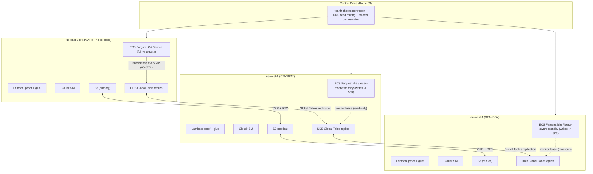
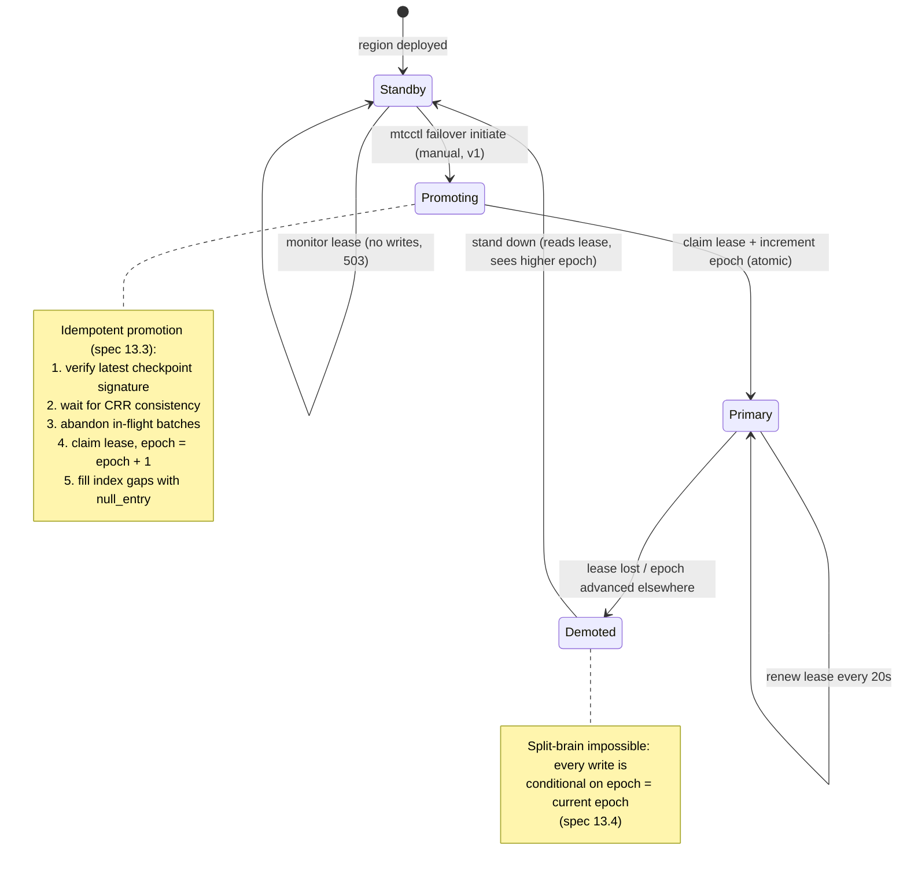

# Multi-Region Active-Passive Topology

> **Source of truth:** [`docs/mtc-architecture-spec.md`](../mtc-architecture-spec.md) §7
> (High-Level Architecture: three-region deployment), §8.3 (lease semantics), and §13
> (Failover and Disaster Recovery).
> The topology diagram renders §7; the failover state diagram renders §8.3 + §13.
>
> **Update this page when:** the region set changes, replication mechanics change (CRR/RTC,
> Global Tables), lease timing constants change (renew interval, TTL), or the failover procedure
> in §13.3 changes. Any PR touching lease/epoch coordination or promotion logic must update this
> page in the same PR.

## Topology (spec §7)

Three regions deployed identically; exactly one holds the primary-region lease at any moment.

## Lease and failover state machine (spec §8.3, §13)

## Reading guide

- **Active-passive**: the write path executes only in the lease-holding region; standbys reject
  writes with 503 (spec §11). Reads are served from every region via Route 53 routing.
- **Lease timing** (spec §8.3): renewed every 20s by the holder, 60s TTL; expiry beyond the safety
  margin makes the lease takeover-eligible.
- **Failover is manual in v1** (spec §13.2): a human runs `mtcctl failover initiate`; RTO 5–15 min,
  RPO zero for committed work (spec §13.5).
