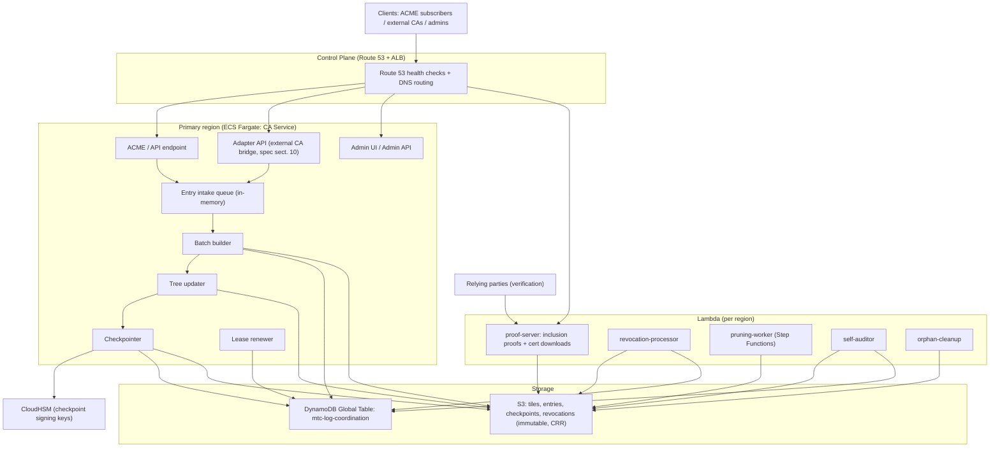

# System Overview

> **Source of truth:** [`docs/mtc-architecture-spec.md`](../mtc-architecture-spec.md) §7 (High-Level Architecture).
> This diagram renders the §7 component inventory and data flow for a single (primary) region plus the control plane.
>
> **Update this page when:** components are added/removed/renamed in §7, a component moves between
> compute platforms (Fargate vs Lambda), or a storage/coordination dependency changes. Any PR that
> changes §7's component table must update this diagram in the same PR.

## Components and data flow

## Reading guide

- The **write path** flows top-to-bottom inside the primary region: intake → batch builder →
  tree updater → checkpointer (detailed step-by-step in
  [`write-path-sequence.md`](write-path-sequence.md), spec §11).
- Only the **primary** region runs the write path; standby regions run the same deployment in
  lease-aware idle (see [`multi-region-topology.md`](multi-region-topology.md), spec §7/§13).
- **Lambdas** serve the read path and event glue; they never hold the lease and never write
  log content (spec §5, §12).
- **S3** holds all immutable log content; **DynamoDB** holds only coordination state
  (counter, lease, pointers, batch status — see [`data-model.md`](data-model.md), spec §8).
