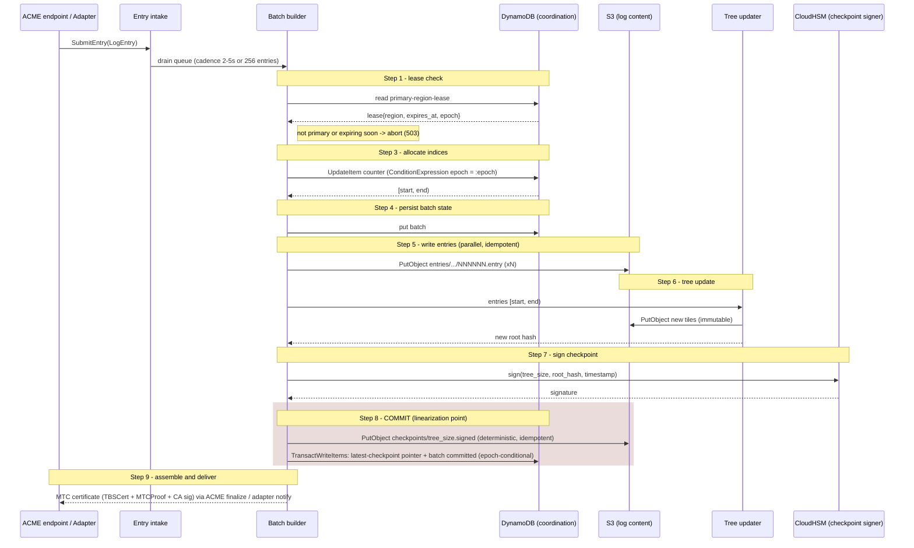

# Write Path Sequence

> **Source of truth:** [`docs/mtc-architecture-spec.md`](../mtc-architecture-spec.md) §11 (Write Path),
> specifically the §11.1 lifecycle and §11.2 critical invariants.
> This diagram renders the nine lifecycle steps: intake → batch builder → tree updater → checkpoint signer → commit → deliver.
>
> **Update this page when:** §11.1 steps are added/removed/reordered, the linearization point moves,
> ordering invariants change (S3-first/DDB-second), or the epoch/lease conditional-write rules in
> §11.2 change. Any PR that changes `CaService::issue_batch` semantics must update this diagram in
> the same PR.

## Issuance lifecycle (spec §11.1 steps 1–9)

## Invariants this diagram encodes (spec §11.2)

- **Step 8 is the linearization point** — nothing is issued until the checkpoint object exists
  and the DDB transaction commits.
- **Counter never decreases** — abandoned indices become permanent gaps filled with `null_entry`.
- **Epoch in every conditional write** (steps 3, 4, 8) — an old primary cannot write after an
  epoch advance (see [`multi-region-topology.md`](multi-region-topology.md)).
- **S3 first, DDB second** — orphan S3 objects from failed transactions are harmless and cleaned
  up by lifecycle policy / orphan-cleanup Lambda (§11.3).
- Step numbering follows §11.1; step 2 (batch assemble) is the `Intake → Batch builder` drain edge.
